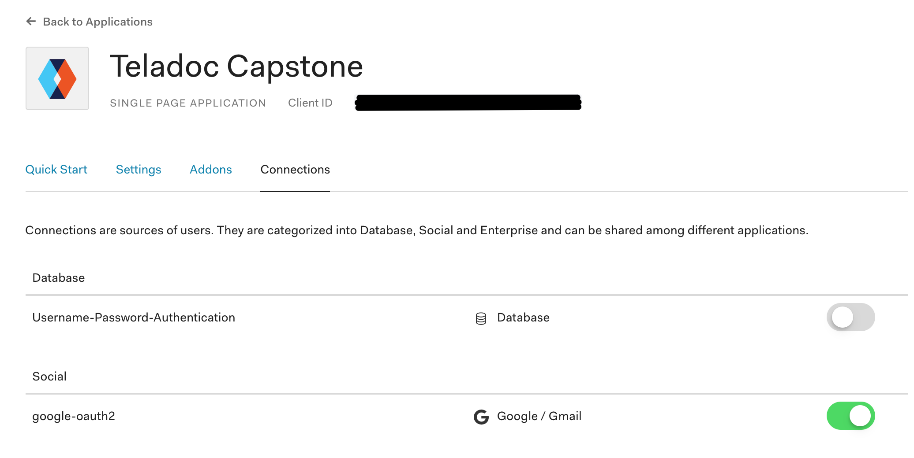
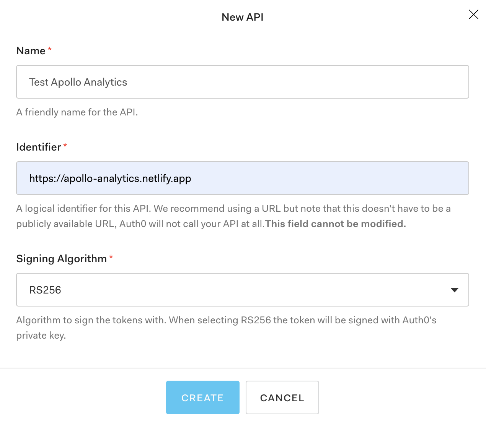
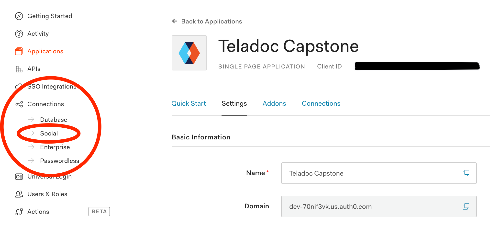

# Setting up Authentication on Localhost

(For authentication on Heroku, follow all of these instructions first, then scroll down to the section for Heroku).

This project uses Auth0 and Google OAuth for authentication (checking usernames and passwords for logging in).

Auth0 is a service that allows you to set up an application where you "login in with Google" or "login with GitHub" or "login with Facebook", etc. (This process of allowing users to login into an application with multiple providers is sometimes called _Federated Login_).

## Setting up Auth0

First, [sign up for an account with Auth0](https://auth0.com/signup); we suggest using your GitHub credentials as your login for Auth0. You will be asked to create a _tenant_ (a _tenant_ in this case, is just an instance of using Auth0 for some application or set of applications. You need at least one _tenant_ before you can start using Auth0.)

Next, register a new application. You do this by navigating to the "Applications" page in the sidebar and clicking the
"Create Application" button. Give it a name (e.g. `test-demo-spring-react-app`) and ensure you set it up as a "Single Page Application".

In the configuration for the application you just created, click on the "Settings" tab and fill in the following values
in the appropriate fields:

| Field                 | Value                                        |
| --------------------- | -------------------------------------------- |
| Allowed Callback URLs | http://localhost:3000, http://localhost:8080 |
| Allowed Logout URLs   | http://localhost:3000, http://localhost:8080 |
| Allowed Web Origins   | http://localhost:3000, http://localhost:8080 |

Make sure to click "Save Changes" at the bottom of the page to save your changes.

## Secrets files (e.g. `.env.local.SAMPLE`)

This section describes files such as `.env`, `secrets-localhost.properties`, `secrets-heroku.properties` etc. in which we store application _secrets_.

It is typical for web applications to require _secrets_, i.e. values that are passed to various services (such as Auth0, a database, cloud platforms, etc.) in order to make things work. Tutorials often show code that has these secrets hardcoded into your source code (in Java, JavaScript, Python, etc.). This is a bad idea; don't do this. If you put these values in your source code, they often end up in Github, and eventually get leaked, creating security vulnerabilities.

Instead, a better practice is:

- Designate a file such as `.env` that is is your `.gitignore` (and thus never stored in GitHub)
- Put your secrets in this file
- Access the secrets from your Java, JavaScript, Python code (or whatever language).

It is common practice to have a file such as `.env.SAMPLE` that can be used as a template for the `.env` file; this file DOES often exist in the Github repo. You can copy this file to `.env` and then edit it to put in your secrets.

In this repo, we have the following templates for secrets:

| Template                              | File you should copy it to     | explanation                                     |
| ------------------------------------- | ------------------------------ | ----------------------------------------------- |
| `secrets-localhost.properties.SAMPLE` | `secrets-localhost.properties` | Java Spring Boot backend when running locally   |
| `secrets-heroku.properties.SAMPLE`    | `secrets-heroku.properties`    | Java Spring Boot backend when running on Heroku |
| `javascript/.env.local.SAMPLE`        | `javascript/.env.local`        | React Frontend code when running locally        |
| `javascript/.env.production.SAMPLE`   | `javascript/.env.production`   | React Frontend code when running on Heroku      |

## Now returning to the Auth0 configuration...

On the same page you should see a "Domain" and "Client ID".

- Copy those values into your `javascript/.env.local` file.
- You may also see other fields such as `REACT_APP_AUTH0_AUDIENCE`; don't worry about those for now. We'll fill in the other fields in later steps.

In the "Connections" tab of **your app** (not from the sidebar)

- Uncheck Username-Password-Authentication.
- Ensure `google-oauth2` is checked (it should be by default).
  See image below for an example of what it should look like.

## Creating an Auth0 API and filling in the `Audience` value

To fill in the value for `REACT_APP_AUTH0_AUDIENCE` in your `javascript/.env.local` file, go to the sidebar in Auth0, and locate the `APIs` tab.

You should see (at least) one API listed, namely the `Auth0 Management API`. This API is used to manage all other APIs, so we'll create an API that is specific to just our application.

First, click on the `Create API` button.

Next, fill in the fields as follows:
| Field name | Value | Description |
|------------|-------|-------------|
| Name | The name of your application | This is just a visual name for the Auth0 API of your application, so make it readable. Example `Test Demo Spring React App`|
| Identifier | Put a unique identifier here such as `https://REPLACE-ME.herokuapp.com`, replacing `REPLACE-ME` with your hyphenated application name | This will end up serving as the `Audience` value. |
| Signing algorithm | RS256 | This determines what cryptographic algorithm is used to verify tokens. The standard is RS256, so we use that here |

It should end up looking like the below image (with your application name):

Hit `Create`, and navigate to the `Settings` tab of your API, and find the `Identifier` field. You should copy that value and paste it into the `REACT_APP_AUTH0_AUDIENCE` value in your `javascript/.env.local` file.

## Setting up Google OAuth

You are now going to set the clientId and client secret for the Google OAuth "Social Login Connection" for _your entire Auth0 tenant_. Note that there is only one of these per tenant. It can be shared across multiple applicants within the same tenant, so if you end up creating multiple Google OAuth applications in the same tenant, you only need to do this step once.

To do this, you will need to log in to your Google Account and create a Google OAuth Application. We suggest you use the Google Account associated your UCSB email address.

The instructions below are based on the instructions <a href="https://developers.google.com/identity/sign-in/web/sign-in" target="_blank">here</a>.

Before you start, get the Auth0 domain loaded in one of your browser tabs; you can find it by navigating to your account on <https://auth0.com>, clicking on "Applications in the side bar, locating one of the specific applications you created (e.g. `test-demo-spring-react-app` and then locating `Auth0 Domain` as a field in the settings tab. This "domain" is consistant across all applications in your tenant.

1. Navigate to page <a href="https://developers.google.com/identity/sign-in/web/sign-in" target="_blank">Google OAuth Instructions</a> and click where it says "Go to the Credentials Page".
2. Click `Create credentials > OAuth client ID.`
3. Select the `Web application` application type.
4. Name your OAuth 2.0 client (e.g. `test-demo-spring-react-app`).
5. Add an authorized JavaScript origin with the value `https://<Auth0 Domain>`.
6. Add an authorized redirect URI, with the value `https://<Auth0 Domain>/login/callback`, replacing `<Auth0 Domain>` with the `Auth0 Domain` listed in the Auth0 settings for your app. (It should look something like: `https://dev-pfjsl7rp.auth0.com/login/callback`, without the `<>` in it.)
7. Scroll down and click "Create" to create your Google OAuth App.
8. You should see a pop-up with a "Client ID" and "Client Secret"; _leave this browser tab open for a moment_. You will need to copy these values in the next step.

Now, return to the browser tab open to your Auth0 application.

- Do not be confused that there is a Client Id and Client Secret on Auth0 page; this is a _different_ client id and client secret.
- Instead, navigate to the "Connections -> Social" page in the sidebar, as shown in the image below.
- Click on "Google" and fill in the "Client ID" and "Client Secret" you just generated.
- Make sure to scroll down and click "Save Changes" at the bottom of the dialog to save your changes.

When you have completed this step, you may return to the main instructions in the [../README.md](../README.md) to continue.

# Setting up Authentication on Heroku

Follow all of the instructions above first for getting your app working on Localhost.

In order for Auth0 to recognize the app running on your new production url, you will need to make a small change to the
app you created in the first step.

Navigate back to the settings page of the app you created in the Auth0 dashboard. For every field that references
http://localhost:3000, add a comma-separated entry after the existing entry referencing your new production url instead
of localhost. It is important you include both localhost and production urls so that both your localhost and production
apps will work properly.

For example, if your production url is , https://your-heroku-app-name.heroku.com, your fields should now look like this:

| Field                 | Value                                                                                 |
| --------------------- | ------------------------------------------------------------------------------------- |
| Allowed Callback URLs | http://localhost:3000, https://your-netlify-app-name.netlify.app |
| Allowed Logout URLs   | http://localhost:3000, https://your-netlify-app-name.netlify.app |
| Allowed Web Origins   | http://localhost:3000, https://your-netlify-app-name.netlify.app |

Don't just copy the above values, replace , https://your-netlify-app-name.netlify.app with the link to your own deployment of
the production app.

Don't forget to click "Save Changes" at the bottom of the page!

The next step is to set up the files for production/Heroku for both the frontend and backend. Please return to the instructions in the main [../README.md](../README.md) to continue.
